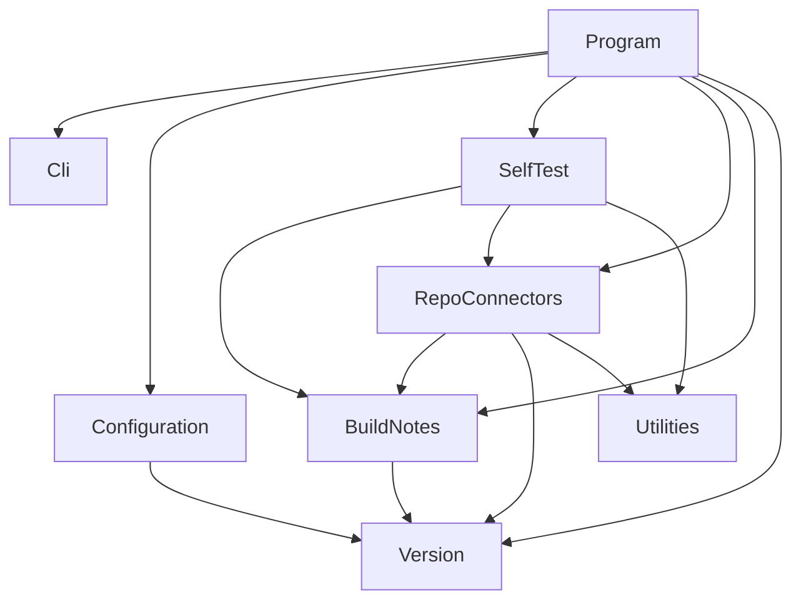

# BuildMark


## Architecture

BuildMark is composed of seven subsystems and a top-level entry-point unit. The diagram below
shows the subsystem-level dependency relationships:



- **Program** (Unit) — entry point; dispatches to handlers based on parsed CLI flags.
- **Cli** (Subsystem) — command-line argument parsing, output channel control, and exit code
  tracking.
- **BuildNotes** (Subsystem) — output data model shared by all connectors and by `Program`;
  contains the markdown renderer.
- **Configuration** (Subsystem) — parses the optional `.buildmark.yaml` configuration file.
- **RepoConnectors** (Subsystem) — repository metadata retrieval, item-controls parsing, and
  concrete GitHub and Azure DevOps connectors.
- **SelfTest** (Subsystem) — built-in self-validation test framework invoked by `--validate`.
- **Utilities** (Subsystem) — shared path combination and process execution helpers.
- **Version** (Subsystem) — semantic version parsing, comparison, and interval processing.

## External Interfaces

**Command line**: Standard input interface for operator instructions.

- *Type*: CLI (POSIX-style flags and arguments)
- *Role*: Consumer — BuildMark reads arguments provided by the calling process.
- *Contract*: `Context.Create(string[] args)` parses flags including `--build-version`,
  `--report`, `--depth`, `--validate`, `--lint`, `--include-known-issues`, `--silent`,
  `--log`, and `--results`.
- *Constraints*: Unrecognized flags cause `ArgumentException`; missing value arguments cause
  `ArgumentException`; depth must be an integer in the range 1–6.

**`.buildmark.yaml`**: Optional YAML configuration file at the repository root.

- *Type*: File (YAML)
- *Role*: Consumer — BuildMark reads the file if present.
- *Contract*: Parsed by `BuildMarkConfigReader.ReadAsync`; supplies connector selection,
  section definitions, and routing rules. Absence is not an error; default configuration is
  used.
- *Constraints*: YAML parse errors and invalid values are reported via
  `ConfigurationLoadResult.Issues`; the `--lint` flag validates without running a build.

**GitHub GraphQL API**: Remote API for querying GitHub repository metadata.

- *Type*: HTTP/REST (HTTPS POST with GraphQL body)
- *Role*: Consumer — BuildMark queries GitHub for tags, commits, issues, pull requests, and
  releases.
- *Contract*: `GitHubGraphQLClient` sends paginated queries to
  `https://api.github.com/graphql` by default; the endpoint is overridden by
  `GitHubConnectorConfig.BaseUrl` when set, enabling GitHub Enterprise Server support
  (e.g., `https://github.mycompany.com/api/graphql`). Authentication uses
  `Authorization: bearer <token>`.
- *Constraints*: Authentication via `GH_TOKEN` or `GITHUB_TOKEN` environment variable, or
  `gh auth token` CLI fallback; subject to GitHub API rate limits.

**Azure DevOps REST API**: Remote API for querying Azure DevOps repository metadata.

- *Type*: HTTP/REST (HTTPS GET/POST to Azure DevOps `_apis` endpoints v6.0)
- *Role*: Consumer — BuildMark queries Azure DevOps for tags, commits, pull requests, and
  work items.
- *Contract*: `AzureDevOpsRestClient` sends paginated requests using `Basic` authorization
  (PAT tokens) or `Bearer` authorization (Entra ID / `SYSTEM_ACCESSTOKEN` tokens).
- *Constraints*: Authentication via `AZURE_DEVOPS_PAT`, `AZURE_DEVOPS_TOKEN`,
  `AZURE_DEVOPS_EXT_PAT`, or `SYSTEM_ACCESSTOKEN` environment variables, or
  `az account get-access-token` CLI fallback.

**Markdown report**: Output file containing the generated build notes.

- *Type*: File (UTF-8 Markdown)
- *Role*: Provider — BuildMark writes the report to the path specified by `--report` or
  `report.file` in configuration.
- *Contract*: Generated by `BuildInformation.ToMarkdown`; heading depth configurable via
  `--depth` (default 1). Absence of `--report` means no file is written.
- *Constraints*: File-system errors during write are caught and reported via
  `context.WriteError`; execution continues with exit code 1.

**Log file**: Optional output file for capturing console output.

- *Type*: File (plain text)
- *Role*: Provider — BuildMark mirrors all console output to the specified file.
- *Contract*: Written by `Context` to the path specified by `--log`; opened in overwrite mode
  with `AutoFlush`.
- *Constraints*: `InvalidOperationException` if the target directory does not exist.

**Test results file**: Optional output file for self-validation results.

- *Type*: File (TRX or JUnit XML)
- *Role*: Provider — BuildMark writes self-test results when `--results <file>` is specified
  and `--validate` is active.
- *Contract*: Supports `.trx` (Visual Studio Test Results) or `.xml` (JUnit format) based on
  file extension.
- *Constraints*: Unsupported extensions are reported as an error; no file is written.

**Exit code**: Numeric exit code returned to the calling process.

- *Type*: Process exit code
- *Role*: Provider
- *Contract*: 0 = success; 1 = any error (invalid arguments, configuration errors, API
  errors, or self-test failures).
- *Constraints*: None.

## Dependencies

- **YamlDotNet**: used for parsing `.buildmark.yaml` configuration files via the `YamlStream`
  representation model — see *YamlDotNet Integration Design*
- **DemaConsulting.TestResults**: used for TRX and JUnit XML test results serialization in the
  SelfTest subsystem; no separate design document in this collection
- **System.Net.Http** (.NET built-in): used by `GitHubGraphQLClient` and
  `AzureDevOpsRestClient` for HTTPS communication with the GitHub and Azure DevOps APIs; no
  separate design document

## Risk Control Measures

N/A — BuildMark is a build-tooling utility with no safety-critical functions and no
subsystems that require isolation from each other for risk-control purposes. All subsystems
run in the same process and share the same memory address space; no inter-process or
memory-boundary segregation is required.

## Data Flow

```text
[Command Line Args]
        │
        ▼
  Context (Cli)          ← parses flags, opens log file
        │
        ▼
  Program.Run()
        ├─ --version  →  writes version to stdout
        ├─ --help     →  writes usage to stdout
        ├─ --validate →  Validation (SelfTest) → writes results to --results file
        ├─ --lint     →  BuildMarkConfigReader (Configuration)
        │                  reads .buildmark.yaml, reports issues, exits
        └─ (default)  →  ProcessBuildNotes()
                              │
                              ├──────────────────────────────────────────────┐
                              ▼                                              │
               BuildMarkConfigReader (Configuration)                        │
                    reads .buildmark.yaml (optional)                        │
                    returns ConfigurationLoadResult                          │
                    reports any issues to Context                            │
                              │                                              │
                              ▼                                              │
                   RepoConnectorFactory ◄────────────────────────────────────┘
                    (uses ConnectorConfig + environment detection)
                              │
                      ┌───────┴───────┐
                      ▼               ▼
           GitHubRepoConnector  AzureDevOpsRepoConnector
              ←── GitHub           ←── Azure DevOps
                GraphQL API            REST API (v6.0)
                      │               │
                      ▼               ▼
                   ItemControlsParser / WorkItemMapper
                              │  ← applied per-issue/PR/work-item
                              │  ← overrides visibility, type, affected-versions
                              │  ← applies SectionConfig / RuleConfig via ItemRouter
                              ▼
                   BuildNotes.BuildInformation.ToMarkdown()
                              │
                              ▼
                   [Markdown Report File]
```

## Design Constraints

- **Target framework**: .NET 8, .NET 9, and .NET 10
- **Platform support**: Windows, Linux, macOS
- **Packaging**: Published as a .NET global tool (`dotnet tool install`)
- **Authentication**: GitHub token supplied via `GH_TOKEN` or `GITHUB_TOKEN` environment
  variable, or `gh auth token` CLI fallback; Azure DevOps token supplied via
  `AZURE_DEVOPS_PAT`, `AZURE_DEVOPS_TOKEN`, `AZURE_DEVOPS_EXT_PAT`, or
  `SYSTEM_ACCESSTOKEN` environment variables, or `az account get-access-token` CLI fallback
- **No GUI**: All interaction is through the command line; no interactive prompts
- **Self-contained**: The tool operates without any configuration file; an optional
  `.buildmark.yaml` file in the repository root enables connector selection and item routing
  customization
- **Configuration linting**: Malformed configuration file issues are reported to the user via
  `ConfigurationLoadResult.ReportTo`; the `--lint` flag validates the configuration file and
  exits without performing a build

## Integration Patterns

### Configuration File

`BuildMarkConfigReader.ReadAsync(path)` looks for a `.buildmark.yaml` file at the supplied
path (normally the repository root). The file is parsed using the YamlDotNet library's
representation model (`YamlStream`), then the resulting node tree is walked to build the
configuration objects. The method always returns a `ConfigurationLoadResult`:

- If the file is absent, `Config` is `null` and `Issues` is empty; the tool proceeds with
  default behavior.
- If the file is present but contains YAML errors or invalid values, `Config` may be `null`
  and `Issues` contains one or more `ConfigurationIssue` records, each carrying a `FilePath`,
  `Line`, `Severity` (`Error` or `Warning`), and `Description`. `ReportTo(context)` writes
  each issue to the log and sets the exit code to 1 when any issue is an error.
- If the file is valid, `Config` is a fully populated `BuildMarkConfig` and `Issues` is empty.

`Program` calls `result.ReportTo(context)` immediately after reading the configuration. The
`--lint` flag causes `Program` to stop after this step, allowing operators to validate the
configuration file without running a build.

When a valid `BuildMarkConfig` is available, its properties are consumed as follows:

- `BuildMarkConfig.Connector` — optional `ConnectorConfig` carrying the connector `Type`
  (`"github"` or `"azure-devops"`), a `GitHub` property holding a `GitHubConnectorConfig`,
  and an `AzureDevOps` property holding an `AzureDevOpsConnectorConfig`. The connector
  config is passed to `RepoConnectorFactory` to select the appropriate connector
  implementation.
- `BuildMarkConfig.Sections` — ordered list of `SectionConfig` objects (each with an `Id`
  and `Title`) that define the report sections. Passed to the active connector for output
  structuring.
- `BuildMarkConfig.Rules` — list of `RuleConfig` objects that map item attributes (labels,
  work-item types) to report sections. Passed to the active connector for item routing.

### GitHub GraphQL Client

`GitHubRepoConnector` uses `GitHubGraphQLClient` to issue paginated GraphQL queries over
HTTPS. Authentication is via `Authorization: bearer <token>` header. The connector retrieves
all tags, commits, issues referenced by commits, pull requests, and releases. The `body`
field of issues and pull requests is fetched so that `ItemControlsParser` can extract
embedded `buildmark` blocks.

### Azure DevOps REST Client

`AzureDevOpsRepoConnector` uses `AzureDevOpsRestClient` to issue paginated REST API requests
over HTTPS against Azure DevOps API v6.0 endpoints. Authentication is via a `Basic`
authorization header (for PAT tokens) or a `Bearer` authorization header (for Entra ID
tokens). The connector retrieves all tags (with `peelTags=true`), complete commit history,
all pull requests, work items linked to pull requests, and open work items via WIQL query.

### Item Controls

When connectors process each issue, pull request, or work item, they pass the description
body to `ItemControlsParser.Parse`. If a `buildmark` code block is present (including when
hidden inside an HTML comment), the parser returns an `ItemControlsInfo` record carrying
optional overrides for `Visibility`, `Type`, and `AffectedVersions`. Azure DevOps custom
fields (`Custom.Visibility`, `Custom.AffectedVersions`) take precedence over buildmark
blocks when both are present.

The connector applies these overrides as follows:

- `visibility: internal` — the item is excluded from all report sections
- `visibility: public` — the item is included regardless of its label-derived type
- `type: bug` or `type: feature` — overrides the label-derived type classification
- `affected-versions` — stored on the `ItemInfo` record for downstream use

### Self-Validation

The `--validate` flag invokes `Validation.Run`, which exercises core tool functionality using
a `MockRepoConnector` and writes a standard TRX or JUnit XML results file. This allows
operators to verify the tool works correctly in their environment without requiring a live
GitHub connection.

### Report Generation

`BuildInformation.ToMarkdown` converts the in-memory build data model into a markdown string.
The heading depth is configurable via `--depth`, allowing the report to be embedded at any
level in a larger document.
