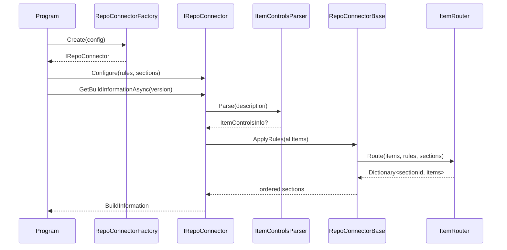

## RepoConnectors

### Overview

The RepoConnectors subsystem abstracts access to repository metadata for BuildMark. It defines the
contract for all repository connectors via `IRepoConnector`, provides shared infrastructure in
`RepoConnectorBase`, and supplies `RepoConnectorFactory` to select the appropriate connector at
runtime. Shared utilities `ItemRouter`, `ItemControlsParser`, and `ItemControlsInfo` are used by
every connector to route items into report sections and apply embedded `buildmark` block overrides.

The subsystem contains the following units directly:

- `IRepoConnector` — the connector contract; defines `GetBuildInformationAsync`.
- `RepoConnectorBase` — abstract base class implementing `IRepoConnector`; provides `Configure`,
  `ApplyRules`, `FindVersionIndex`, `FindBaselineForPreRelease`, `FindBaselineForRelease`, and
  `RunCommandAsync`.
- `RepoConnectorFactory` — static factory that selects the appropriate connector implementation
  based on environment variables and the git remote URL.
- `ItemRouter` — static utility that routes `ItemInfo` objects into report sections using
  configured `RuleConfig` entries.
- `ItemControlsParser` — static parser that extracts a `buildmark` fenced code block from an item
  description and parses its key-value fields.
- `ItemControlsInfo` — immutable record carrying the parsed visibility, type, and affected-version
  values.

The subsystem contains the following child subsystems:

- **GitHub** — production connector for GitHub and GitHub Enterprise using the GraphQL API.
- **AzureDevOps** — production connector for Azure DevOps Services and Server using the REST API.
- **Mock** — in-memory connector used by the `--validate` self-test.

### Interfaces

**IRepoConnector**: The in-process .NET contract that all repository connector implementations must
satisfy.

- *Type*: In-process .NET public API.
- *Role*: Provider — the RepoConnectors subsystem exposes this interface to callers in the Program
  unit.
- *Contract*: Single method `GetBuildInformationAsync(VersionTag? version)` returning
  `Task<BuildInformation>`.
- *Constraints*: Callers must invoke `Configure(rules, sections)` on the connector before calling
  `GetBuildInformationAsync` if routing rules are required; the method may throw
  `InvalidOperationException` when authentication or version resolution fails.

**RepoConnectorBase.Configure**: The in-process .NET method for supplying routing configuration to
any connector instance before it is used.

- *Type*: In-process .NET public API.
- *Role*: Provider — exposes routing configuration to the Program unit.
- *Contract*: `Configure(IReadOnlyList<RuleConfig> rules, IReadOnlyList<SectionConfig> sections)`
  stores the rules and sections on the connector; subsequent calls to `GetBuildInformationAsync`
  use these to populate `BuildInformation.RoutedSections`.
- *Constraints*: Must be called before `GetBuildInformationAsync` for routed output to be
  populated; calling it after has no effect on an in-progress invocation.

### Design

The RepoConnectors subsystem separates the connector contract, shared infrastructure, and concrete
implementations into three layers:

1. **Contract layer** — `IRepoConnector` defines the single public method all connectors must
   implement. `RepoConnectorFactory` resolves the appropriate concrete connector at runtime without
   the caller needing to know which platform is in use.

2. **Base layer** — `RepoConnectorBase` provides shared behavior inherited by all production
   connectors: `Configure` and `ApplyRules` for rules-based routing, `FindVersionIndex`,
   `FindBaselineForPreRelease`, and `FindBaselineForRelease` for version resolution, and
   `RunCommandAsync` for delegating shell commands to `ProcessRunner`. `ItemControlsParser` and
   `ItemControlsInfo` are shared utilities called by each connector to apply `buildmark` block
   overrides per item. `ItemRouter` is the central routing engine called by
   `RepoConnectorBase.ApplyRules` to distribute items into configured report sections.

3. **Implementation layer** — the `GitHub`, `AzureDevOps`, and `Mock` child subsystems each
   contain a connector that inherits from `RepoConnectorBase` together with platform-specific
   client and type definitions. Each connector fetches platform data, normalizes it into `ItemInfo`
   records, applies item-controls overrides, calls `ApplyRules` when routing is configured, and
   returns a `BuildInformation` record.

